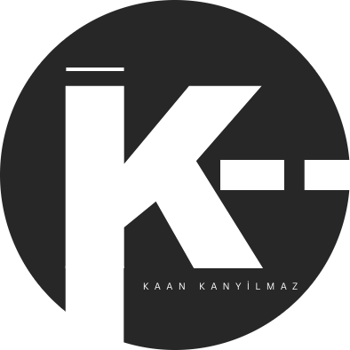

<p align="center">  </p>

 **K--** is a simple, C++-based programming language designed for learning and rapid prototyping.

---

## 🚀 Features

- **Simple and Intuitive Syntax**: Easy to learn and use.
- **Core Programming Constructs**: Includes variables, loops, conditionals, and functions.
- **Static Typing**: Ensures type safety and robustness.
- **Expandable Design**: Ideal for those interested in language development.

---

## 📥 Installation

1. Clone the repository:
   ```bash
   git clone https://github.com/kaankny/K--.git
   cd K--
   ```

2. Compile the source:
   ```bash
   make build
   ```

3. Run the interpreter:
   ```bash
   ./k--
   ```

---

## 🛠️ Usage

### Assign
Define and initialize variables.
```k--
assign int age = 19;
assign string name = "Kaan";
assign bool isStudent = true;
assign float pi = 3.14;
assign char grade = 'A';
```

### Write and Writeln
Output values to the console.
```k--
writeln("Age: " + age);
writeln("Name: " + name);
writeln("Is Student: " + isStudent);
writeln("Pi: " + pi);
writeln("Grade: " + grade);
```

### Read (Coming Soon)
The read statement is used to input values from the user. It supports optional message prompts and file descriptors (FDs). There are multiple supported formats:
```k--
read(varName, varType);
read(varName, varType, "message");

read(fd, varName, varType);
read(fd, varName, varType, "message");

```
-📌 Note: File descriptors other than 0 (stdin) are not yet supported in the interpreter, but are reserved for future extension.

### If-Else
Control flow with conditional statements.
```k--
if (age > 18) {
    writeln("You are an adult.");
} elseif (age == 18) {
    writeln("You are 18 years old.");
} else {
    writeln("You are a child.");
} endif;
```

### Switch-Case
Select from multiple options.
```k--
switch (age) {
	case 18:
	{
		writeln("You are 18 years old.");
		break;
	}
	case 19:
	{
		writeln("You are 19 years old.");
		break;
	}
	default:
	{
		writeln("You are neither 18 nor 19 years old.");
		break;
	}
} endswitch;
```

### Loops
Iterate with `while` and `for` loops.
```k--
assign int i = 0;
while (i < 5) {
    writeln("i: " + i);
    i = i + 1;
} endwhile;

for (assign int j = 0; j < 5; j = j + 1) {
	if (j == 3) {
		continue;
	} endif;
	writeln("j: " + j);
} endfor;
```

### Function Definition and Call
Define reusable functions.
```k--
function isPrime(num: int) -> bool {
    assign bool isPrime = true;
    for (assign int i = 2; i < num; i = i + 1) {
        if (num % i == 0) {
            isPrime = false;
            break;
        } endif;
    } endfor;
    return isPrime;
} endfunction;

assign bool result = call isPrime(7);
writeln("Is Prime: " + result);

writeln("Is Prime: " + call isPrime(10));
```

### Type Casting
Convert between types.
```k--
assign float f = 3.14;
assign int i = (int)f;
```

### Operator Precedence
In K--, expressions follow a predictable operator precedence similar to C-like languages. You can override the default precedence using parentheses () to control the order of evaluation.
Operator Precedence Table (Highest to Lowest)

| Precedence Level | Operators            | Description                     |
|------------------|----------------------|---------------------------------|
| 1 (Highest)      | `()`                 | Parentheses                     |
| 2                | `(int)`, `(float)`   | Type Casting                    |
| 3                | `* / %`              | Multiplication, Division, Mod   |
| 4                | `+ -`                | Addition, Subtraction           |
| 5                | `< <= > >= == !=`    | Comparison Operators            |
| 6                | `&&`                 | Logical AND                     |
| 7 (Lowest)       | `\|\|`               | Logical OR                      |

- 📌 Use parentheses liberally to avoid ambiguity and make your code more readable.
---

## 🛠️ Building K-- Programs

1. Write your K-- code in a `.knn` file:
   ```bash
   nano example.knn
   ```

2. Run the code with the interpreter:
   ```bash
   ./k-- example.knn
   ```

---

## ✅ TODO

Planned features for upcoming releases:
- [ ] soon soon soon
      
Contributions to the TODO list are welcome!

---

## 📄 License

This project is licensed under the MIT License. See the [LICENSE](LICENSE) file for details.

---

## 💬 Support

If you have questions, feel free to reach out via [GitHub Issues](https://github.com/kaankny/k--/issues).

---

## 🌐 Links

soon soon soon

---

Happy Coding with **K--**! 😊

